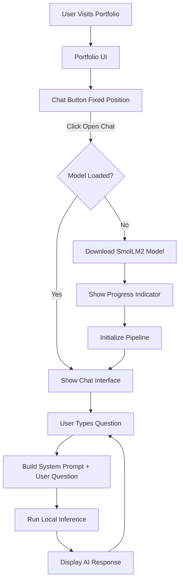

# On-Device AI Chatbot Implementation Plan

## Overview

Add a browser-based AI chatbot to your portfolio that uses the SmolLM2-135M-Instruct-ONNX model (135M parameters, 4-bit float16 quantization) to answer questions about your professional background. The model will be loaded on-demand using Transformers.js and will process queries entirely in the browser.

## Architecture




## Tech Stack

- **Transformers.js** (`@xenova/transformers`): ONNX Runtime Web wrapper for running models
- **Model**: SmolLM2-135M-Instruct-ONNX (model_q4f16.onnx)
- **Context Source**: `[src/data/ai-context.md](src/data/ai-context.md)` - 274 lines of professional information
- **UI**: Tailwind CSS (existing in project) + Framer Motion (for animations)
- **State Management**: React useState hooks (no additional library needed)

## Implementation Steps

### 1. Install Dependencies

Add Transformers.js to `[package.json](package.json)`:

```bash
npm install @xenova/transformers
```

### 2. Create AI Service Module

**File**: `src/services/aiChatService.ts`

This module will handle:

- Lazy model loading (only when chat opens)
- Progress callback system
- Text generation pipeline
- Memory management

Key implementation details:

- Use `pipeline('text-generation', 'HuggingFaceTB/SmolLM2-135M-Instruct')` with quantized model
- Set `quantized: true` in pipeline options to use `model_q4f16.onnx`
- Implement progress callback: `progress_callback: (progress) => { /* update state */ }`
- Cache the pipeline instance to avoid re-downloading

### 3. Prepare System Context

**File**: `src/data/chatContext.ts`

- Read content from `[src/data/ai-context.md](src/data/ai-context.md)`
- Format as system prompt for the model
- Structure: "You are an AI assistant representing Nguyen Trung Thong... Answer questions based on: [context]"
- Keep context under ~2000 tokens to leave room for conversation history

### 4. Create Chat Components

#### 4.1 Chat Toggle Button Component

**File**: `src/components/ChatToggleButton.tsx`

- Fixed position button (bottom-right corner)
- Icon: message circle or chat bubble (use Lucide React icons)
- Styling: Match portfolio aesthetic (Tailwind classes)
- States: default, hover, loading
- Click handler: triggers chat panel open + model loading

#### 4.2 Chat Panel Component

**File**: `src/components/ChatPanel.tsx`

Main chat interface with:

- Slide-in animation from right (Framer Motion)
- Header with title "Ask about Thong" and close button
- Message list area (scrollable)
- Input field with send button
- Model loading indicator (shows during first open)

Subcomponents to create:

**File**: `src/components/ChatMessage.tsx`

- Display user and AI messages
- Different styling for user vs AI messages
- Timestamp (optional)
- Loading indicator for AI response (typing animation)

**File**: `src/components/ChatInput.tsx`

- Text input field
- Send button (disabled when model loading or generating)
- Enter key support
- Auto-focus on mount

**File**: `src/components/ModelLoadingProgress.tsx`

- Progress bar component
- Shows download percentage and current file being loaded
- Display format: "Loading model... 45% (model_q4f16.onnx)"
- Smooth progress animation using Framer Motion

### 5. State Management

**File**: `src/components/ChatPanel.tsx` (main state container)

State structure:

```typescript
const [isOpen, setIsOpen] = useState(false)
const [isModelLoading, setIsModelLoading] = useState(false)
const [isModelReady, setIsModelReady] = useState(false)
const [loadingProgress, setLoadingProgress] = useState({ progress: 0, file: '', status: '' })
const [messages, setMessages] = useState<Message[]>([])
const [isGenerating, setIsGenerating] = useState(false)
const [error, setError] = useState<string | null>(null)
```

### 6. Integration into App

**File**: `[src/App.tsx](src/App.tsx)`

Add chat components to the app:

- Import `ChatToggleButton` and `ChatPanel`
- Place after `<Footer />` so it appears on top of all content
- No lazy loading for chat components (they're already lazy internally)

Example integration:

```typescript
<Footer />
<ChatToggleButton onClick={() => setIsChatOpen(true)} />
<ChatPanel isOpen={isChatOpen} onClose={() => setIsChatOpen(false)} />
```

### 7. Model Configuration

Model-specific settings:

- **Model ID**: `HuggingFaceTB/SmolLM2-135M-Instruct`
- **Quantization**: 4-bit float16 (`model_q4f16.onnx`)
- **Max new tokens**: 256 (sufficient for answers)
- **Temperature**: 0.7 (balanced creativity/accuracy)
- **Top-p**: 0.9 (nucleus sampling)
- **Repetition penalty**: 1.1 (reduce repetition)

Model loading will:

1. Download ~117MB ONNX model file (4-bit quantized)
2. Download tokenizer files (~500KB)
3. Initialize WASM runtime
4. Create inference session

Expected loading time: 5-15 seconds on good connection

### 8. Prompt Engineering

Format for model input:

```
<|im_start|>system
You are an AI assistant representing Nguyen Trung Thong, a Frontend Developer.
Answer questions based on this information:

[Content from ai-context.md]

Keep answers concise and accurate.<|im_end|>
<|im_start|>user
{user_question}<|im_end|>
<|im_start|>assistant
```

SmolLM2-Instruct uses ChatML format with special tokens.

### 9. UI/UX Enhancements

- **Chat button**: Subtle pulse animation to draw attention
- **Smooth transitions**: Framer Motion slide/fade animations
- **Responsive design**: Mobile-friendly chat panel (full screen on mobile, sidebar on desktop)
- **Error handling**: Clear error messages if model fails to load
- **Retry mechanism**: Allow retry if download fails
- **Typing indicator**: Show "..." while AI is generating response

### 10. Performance Optimizations

- **Web Worker**: Consider moving inference to Web Worker to prevent UI blocking (optional for 135M model)
- **Streaming**: Display tokens as they're generated for better UX (if supported)
- **Model caching**: Browser will cache the model files automatically
- **Memory management**: Clear old messages if conversation gets too long (>10 messages)

### 11. Styling Consistency

Match existing portfolio design:

- Use Tailwind classes consistent with current components
- Background colors: `bg-background-light` (#FBFAF3)
- Text colors: `text-slate-900`
- Border radius: Follow existing `rounded-xl`, `rounded-2xl` conventions
- Fonts: Inter (already loaded)
- Animations: Consistent with Framer Motion usage in existing components

## File Structure

```
src/
├── components/
│   ├── ChatToggleButton.tsx          [NEW]
│   ├── ChatPanel.tsx                  [NEW]
│   ├── ChatMessage.tsx                [NEW]
│   ├── ChatInput.tsx                  [NEW]
│   └── ModelLoadingProgress.tsx       [NEW]
├── services/
│   └── aiChatService.ts               [NEW]
├── data/
│   ├── ai-context.md                  [EXISTING - use as context]
│   └── chatContext.ts                 [NEW]
├── types/
│   └── chat.ts                        [NEW - TypeScript interfaces]
└── App.tsx                            [MODIFY - add chat components]
```

## Model Loading Flow

1. User clicks "Open Chat" button
2. `ChatPanel` mounts and triggers `useEffect`
3. Call `aiChatService.loadModel()` with progress callback
4. Progress updates display in `ModelLoadingProgress` component
5. On complete: hide loading indicator, enable chat input
6. On error: show error message with retry button

## Testing Checklist

- Model downloads successfully on first chat open
- Progress indicator shows accurate percentage
- Chat interface is responsive on mobile and desktop
- AI generates relevant answers based on context
- Error handling works for network failures
- Model doesn't reload on subsequent chat opens
- Messages display correctly with proper styling
- Input field is disabled during generation
- Chat panel animates smoothly

## Browser Compatibility

- Modern browsers with WebAssembly support (Chrome 57+, Firefox 52+, Safari 11+, Edge 16+)
- Requires ~150MB RAM for model + inference
- Works offline after initial model download (cached by browser)

## Future Enhancements (Not in Scope)

- Chat history persistence (localStorage)
- Export chat transcript
- Voice input/output
- Multi-language support
- Conversation memory across sessions

