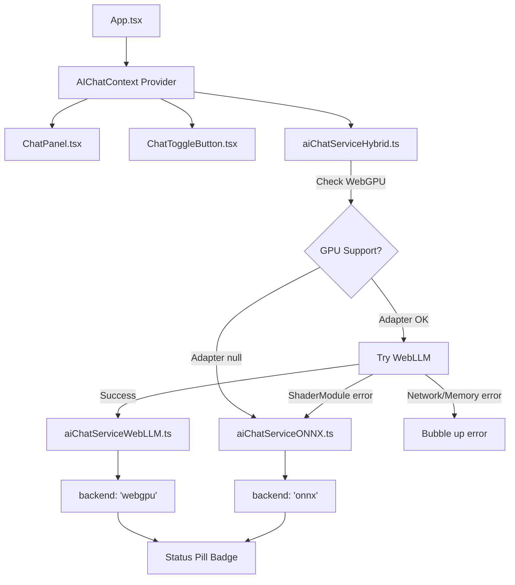

# Hybrid AI Architecture Implementation

## Architecture Overview

The hybrid approach tries WebLLM first, falling back to ONNX when WebGPU adapter is unavailable or shader compilation fails. A React context manages the backend selection and exposes a unified API to UI components.




## Implementation Steps

### 1. Install ONNX Dependency

Add `@xenova/transformers` to `[package.json](package.json)`:

```bash
npm install @xenova/transformers
```

### 2. Create Service Interface

New file: `[src/services/aiChatServiceInterface.ts](src/services/aiChatServiceInterface.ts)`

Define shared interface both backends implement:

```typescript
export interface AIChatService {
  loadModel(onProgress?: ProgressCallback): Promise<void>;
  generateResponse(message: string): Promise<string>;
  isModelReady(): boolean;
  isModelLoading(): boolean;
  dispose(): Promise<void>;
}

export type AIBackend = 'detecting' | 'webgpu' | 'onnx' | 'error';
```

### 3. Refactor WebLLM Service

Rename `[src/services/aiChatService.ts](src/services/aiChatService.ts)` → `[src/services/aiChatServiceWebLLM.ts](src/services/aiChatServiceWebLLM.ts)`

- Keep all existing WebLLM code (CreateMLCEngine, checkWebGPUSupport, etc.)
- Export as a class or object implementing `AIChatService` interface
- No changes to logic

### 4. Create ONNX Service

New file: `[src/services/aiChatServiceONNX.ts](src/services/aiChatServiceONNX.ts)`

Implement `AIChatService` interface using `@xenova/transformers`:

```typescript
import { pipeline, env } from '@xenova/transformers';

// Configure WASM to run in worker
env.allowLocalModels = false;
env.useBrowserCache = true;
if (env.backends?.onnx?.wasm) {
  env.backends.onnx.wasm.proxy = true;
}

// Model: Xenova/Qwen1.5-0.5B-Chat
// Similar structure to WebLLM service but using pipeline()
```

Key implementation points from `feat/local-AI` branch:

- Use `pipeline('text-generation', 'Xenova/Qwen1.5-0.5B-Chat', { quantized: true })`
- Same progress callback pattern as WebLLM
- Same `truncateToTokenLimit` helper from existing code

### 5. Create Hybrid Orchestrator

New file: `[src/services/aiChatServiceHybrid.ts](src/services/aiChatServiceHybrid.ts)`

Main logic:

```typescript
let activeBackend: AIBackend = 'detecting';
let activeService: AIChatService | null = null;

export const loadModel = async (onProgress?: ProgressCallback): Promise<void> => {
  // 1. Check WebGPU support
  const gpuCheck = await checkWebGPUSupport(); // from WebLLM service
  
  // 2. If no adapter → go straight to ONNX
  if (!gpuCheck.supported) {
    activeBackend = 'onnx';
    activeService = onnxService;
    return onnxService.loadModel(onProgress);
  }
  
  // 3. Try WebLLM
  try {
    activeBackend = 'webgpu';
    activeService = webllmService;
    await webllmService.loadModel(onProgress);
  } catch (error) {
    const errorMsg = error instanceof Error ? error.message : '';
    
    // 4. If shader/compute error → fallback to ONNX
    if (errorMsg.includes('ShaderModule') || errorMsg.includes('compute stage')) {
      console.warn('WebGPU partial support detected, falling back to ONNX');
      activeBackend = 'onnx';
      activeService = onnxService;
      return onnxService.loadModel(onProgress);
    }
    
    // 5. Other errors → bubble up
    activeBackend = 'error';
    throw error;
  }
};

export const getBackend = (): AIBackend => activeBackend;

// Proxy other methods to activeService
export const generateResponse = (msg: string) => activeService?.generateResponse(msg);
// ... etc
```

### 6. Create React Context

New file: `[src/contexts/AIChatContext.tsx](src/contexts/AIChatContext.tsx)`

```typescript
interface AIChatContextValue {
  backend: AIBackend;
  loadModel: (onProgress?: ProgressCallback) => Promise<void>;
  generateResponse: (message: string) => Promise<string>;
  isModelReady: boolean;
  isModelLoading: boolean;
  // ... other service methods
}

export const AIChatProvider: React.FC<{ children }> = ({ children }) => {
  const [backend, setBackend] = useState<AIBackend>('detecting');
  
  // Wrap hybrid service methods, update backend state
  const loadModel = async (onProgress) => {
    await hybridService.loadModel(onProgress);
    setBackend(hybridService.getBackend());
  };
  
  // ... return provider with value
};
```

### 7. Wrap App with Context

Update `[src/App.tsx](src/App.tsx)`:

```typescript
import { AIChatProvider } from './contexts/AIChatContext';

// Wrap entire app:
<AIChatProvider>
  <div className="relative min-h-screen w-full">
    {/* existing content */}
  </div>
</AIChatProvider>
```

### 8. Update ChatPanel

Update `[src/components/chatBot/panel/ChatPanel.tsx](src/components/chatBot/panel/ChatPanel.tsx)`:

- Replace direct `aiChatService` imports with `useAIChatContext()` hook
- Remove local WebGPU checking logic (now handled by context)
- Use context methods: `loadModel`, `generateResponse`, etc.

### 9. Add Status Pill Badge

Update `[src/components/chatBot/ChatToggleButton.tsx](src/components/chatBot/ChatToggleButton.tsx)`:

Add minimal colored dot in corner:

```typescript
import { useAIChatContext } from '../../contexts/AIChatContext';

export const ChatToggleButton = ({ onClick }) => {
  const { backend } = useAIChatContext();
  const [isPanelOpenedOnce, setIsPanelOpenedOnce] = useState(false);
  
  // Show pill only after panel opened at least once
  const showPill = isPanelOpenedOnce && backend !== 'detecting';
  
  // Pill color: green = webgpu, blue = onnx, gray = detecting
  const pillColor = backend === 'webgpu' ? 'bg-green-500' 
                  : backend === 'onnx' ? 'bg-blue-500'
                  : 'bg-gray-400';
  
  return (
    <motion.button onClick={() => { onClick(); setIsPanelOpenedOnce(true); }}>
      {/* existing button content */}
      
      {/* Pill badge - top-right corner */}
      {showPill && (
        <span className={`absolute -top-1 -right-1 w-3 h-3 ${pillColor} rounded-full 
                         border-2 border-white`} />
      )}
    </motion.button>
  );
};
```

### 10. Update Types

Update `[src/types/chat.ts](src/types/chat.ts)` if needed:

- Add `AIBackend` type export if not in interface file
- Ensure `LoadingProgress` type works for both backends

### 11. Update Header (Optional Enhancement)

Update `[src/components/chatBot/panel/ChatPanelHeader.tsx](src/components/chatBot/panel/ChatPanelHeader.tsx)`:

Could add subtle backend indicator in the "AI Assistant Ready" text:

```typescript
{isModelReady ? `AI Assistant Ready (${backend === 'webgpu' ? 'Fast' : 'Compatible'})` : 'Loading...'}
```

## Key Design Decisions

1. **Silent Fallback**: No user notification when switching from WebGPU to ONNX - the pill badge changes color to reflect the active backend
2. **Fallback Triggers**: Only on WebGPU adapter unavailability or shader compilation errors, not network/memory errors
3. **State Management**: React Context provides centralized backend state accessible from any chat component
4. **Visual Indicator**: Minimal colored dot on toggle button (green=WebGPU, blue=ONNX), visible once panel is opened
5. **Package Strategy**: Fresh install of `@xenova/transformers` from npm with clean ONNX service implementation

## Testing Strategy

After implementation:

1. **WebGPU device**: Verify WebLLM loads, pill shows green
2. **Non-WebGPU device**: Verify ONNX loads, pill shows blue
3. **Partial WebGPU support** (shader errors): Verify graceful fallback from WebLLM to ONNX
4. **Network error during load**: Verify error surfaces without triggering fallback

