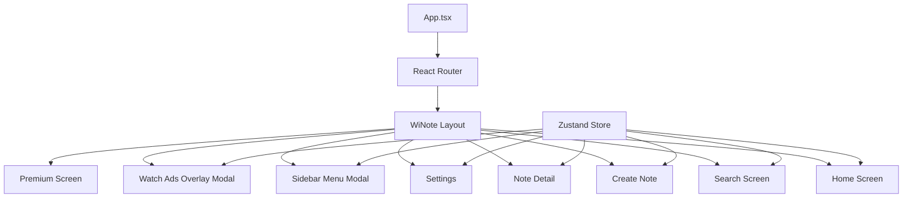

# WiNote UI and Routing Implementation Plan

## Design Analysis Summary

Based on the Figma prototype analysis, WiNote is a note-taking app with a distinctive "clay" design aesthetic featuring:

**Color Palette:**

- Background: Warm beige/cream (#F5F1E8)
- Primary cards: Soft mint green (#C8D9C8)
- Premium/highlight cards: Pale yellow/gold (#E8DCC0)
- Sidebar: Light sage green (#D4E0D4)
- Text: Dark brown/charcoal (#3A3A3A)
- Accents: Soft purple/lavender for search (#E8E4F0)

**Design Features:**

- Clay morphism with soft shadows and subtle insets
- Rounded corners (12-24px)
- Floating action buttons
- Bottom ad banner (non-premium)
- Masonry grid layouts for notes
- Horizontal carousels

## Architecture Overview




## Route Structure

**Main domain:** `/winote`

**Routes:**

- `/winote` - Home (dashboard with forgotten notes & collection)
- `/winote/search` - Search notes with filters
- `/winote/note/new` - Create new note
- `/winote/note/:id` - Note detail/edit view
- `/winote/settings` - User settings & preferences
- `/winote/premium` - Premium feature introduction

**Modal overlays** (not routes):

- Sidebar menu (drawer from left)
- Watch Ads rewards overlay (full-screen modal)
- Terms & Conditions
- Category selector
- Filter options

## File Structure

```
src/
├── winote/
│   ├── index.tsx                 # WiNote app entry point
│   ├── layout/
│   │   ├── WiNoteLayout.tsx     # Main layout wrapper
│   │   ├── Header.tsx           # Search bar & settings icon
│   │   ├── Sidebar.tsx          # Drawer menu
│   │   └── AdBanner.tsx         # Bottom ad banner
│   ├── screens/
│   │   ├── HomeScreen.tsx       # Dashboard
│   │   ├── SearchScreen.tsx     # Search results
│   │   ├── CreateNoteScreen.tsx # New note editor
│   │   ├── NoteDetailScreen.tsx # Edit existing note
│   │   ├── SettingsScreen.tsx   # User settings
│   │   └── PremiumScreen.tsx    # Premium intro
│   ├── components/
│   │   ├── NoteCard.tsx         # Note card variants
│   │   ├── NoteGrid.tsx         # Masonry grid
│   │   ├── NoteCarousel.tsx     # Horizontal scroll
│   │   ├── SearchBar.tsx        # Search input
│   │   ├── FilterChips.tsx      # Filter buttons
│   │   ├── CategoryPills.tsx    # Category tags
│   │   ├── FloatingActionButton.tsx
│   │   ├── ClayButton.tsx       # Clay-styled button
│   │   ├── ClayCard.tsx         # Clay-styled card
│   │   ├── ClayInput.tsx        # Clay-styled input
│   │   ├── FormatToolbar.tsx    # Text formatting
│   │   ├── AIToolbar.tsx        # AI features bar
│   │   └── RewardsOverlay.tsx   # Watch ads full-screen modal
│   ├── store/
│   │   ├── useNotesStore.ts     # Notes state
│   │   ├── useUserStore.ts      # User/auth state
│   │   └── useUIStore.ts        # UI state (sidebar, modals, rewards overlay)
│   ├── styles/
│   │   ├── winote-theme.css     # Design tokens
│   │   └── clay-components.css  # Clay effects
│   ├── hooks/
│   │   ├── useLocalStorage.ts   # PWA data persistence
│   │   └── useNote.ts           # Note CRUD operations
│   └── types/
│       └── index.ts             # TypeScript types
├── App.tsx                       # Update with WiNote route
└── main.tsx
```

## Implementation Steps

### 1. Project Setup & Dependencies

**Install packages:**

```bash
npm install react-router-dom zustand framer-motion
npm install -D @types/react-router-dom
npm install workbox-webpack-plugin workbox-precaching # PWA
```

**Update `[vite.config.js](vite.config.js)`:**

- Configure PWA plugin (VitePWA)
- Add service worker for offline capability
- Configure manifest.json for installable app

### 2. Design System Setup

**Create `[src/winote/styles/winote-theme.css](src/winote/styles/winote-theme.css)`:**

Define CSS variables for the clay design system:

- Colors (beige, greens, yellows, purples)
- Shadows (clay inset/outset effects)
- Border radius values
- Typography scale
- Spacing scale

**Create `[src/winote/styles/clay-components.css](src/winote/styles/clay-components.css)`:**

Clay effect utilities:

- `.clay-card` - Raised card with soft shadow
- `.clay-inset` - Pressed/inset effect
- `.clay-btn` - Button with clay effect
- `.clay-input` - Input with subtle inset

### 3. Routing Setup

**Update `[src/App.tsx](src/App.tsx)`:**

Wrap existing portfolio with Router, add `/winote/`* route that renders the WiNote app separately from the main portfolio.

**Create `[src/winote/index.tsx](src/winote/index.tsx)`:**

Main WiNote router with nested routes using `<Routes>` and `<Route>` for all 6 screens (Home, Search, Create, Detail, Settings, Premium).

**Create `[src/winote/layout/WiNoteLayout.tsx](src/winote/layout/WiNoteLayout.tsx)`:**

Shared layout with:

- Header (search bar, settings icon)
- `<Outlet />` for nested routes
- Sidebar drawer (controlled by UI store)
- Rewards overlay modal (controlled by UI store)
- Ad banner (conditional on premium status)
- Background color and mobile-first constraints

### 4. Zustand State Management

**Create `[src/winote/store/useNotesStore.ts](src/winote/store/useNotesStore.ts)`:**

State:

- `notes: Note[]` - All notes
- `categories: Category[]` - User categories
- `createNote`, `updateNote`, `deleteNote` - CRUD actions
- `searchNotes` - Search/filter logic
- Persist to localStorage

**Create `[src/winote/store/useUserStore.ts](src/winote/store/useUserStore.ts)`:**

State:

- `user: { name, isPremium, avatar }`
- `settings: { darkMode, typography, notifications, sync }`
- `updateSettings`, `togglePremium`

**Create `[src/winote/store/useUIStore.ts](src/winote/store/useUIStore.ts)`:**

State:

- `isSidebarOpen`, `isRewardsOverlayOpen`
- `openSidebar`, `closeSidebar`
- `openRewardsOverlay`, `closeRewardsOverlay`

### 5. Core Components

**Create `[src/winote/components/ClayCard.tsx](src/winote/components/ClayCard.tsx)`:**

Reusable clay card with variants (elevated, inset, small). Props: `variant`, `color`, `children`, `onClick`.

**Create `[src/winote/components/NoteCard.tsx](src/winote/components/NoteCard.tsx)`:**

Note card with:

- Date/timestamp badge
- Title (h3)
- Preview text or checklist items
- Category pills
- Background color based on category
- Click handler to navigate to detail

**Create `[src/winote/components/NoteGrid.tsx](src/winote/components/NoteGrid.tsx)`:**

CSS Grid masonry layout (2 columns) for note cards. Auto-place items with staggered animation on mount (Framer Motion).

**Create `[src/winote/components/SearchBar.tsx](src/winote/components/SearchBar.tsx)`:**

Purple/lavender search input with:

- Search icon (left)
- Placeholder text
- Clear button (when has value)
- Back arrow (on search screen)

**Create `[src/winote/components/FloatingActionButton.tsx](src/winote/components/FloatingActionButton.tsx)`:**

Fixed bottom-right FAB with plus icon. Navigates to `/winote/note/new`. Dark green background with scale animation on hover/tap.

### 6. Screen Implementations

#### Home Screen (`[src/winote/screens/HomeScreen.tsx](src/winote/screens/HomeScreen.tsx)`)

**Structure:**

- Header with sidebar icon + search bar (navigates to search)
- Greeting: "Good morning, [Name]"
- "Forgotten Notes" horizontal carousel (last modified > 7 days ago)
- "Your Collection" masonry grid (recent notes)
- Floating action button
- Bottom ad banner

**Animations:**

- Fade in greeting with slide up
- Stagger carousel items from left
- Stagger grid items with slight delay

#### Search Screen (`[src/winote/screens/SearchScreen.tsx](src/winote/screens/SearchScreen.tsx)`)

**Structure:**

- Search bar with back button and "X" to clear
- Results count + sort dropdown ("Newest")
- Filter chips (All Notes, Text, Audio, Images, To-Do)
- Results in masonry grid
- "Best Match" badge on top result
- "Advanced Search" upsell card (if not premium)

**Animations:**

- Slide in from right
- Filter chips scale on tap
- Results fade in with stagger

#### Create/Detail Note Screens (`[src/winote/screens/CreateNoteScreen.tsx](src/winote/screens/CreateNoteScreen.tsx)`, `[NoteDetailScreen.tsx](src/winote/screens/NoteDetailScreen.tsx)`)

**Structure:**

- Top bar: Back button, "Auto-saved" indicator, Delete button
- Title input (large, placeholder "Untitled Note")
- Metadata chips (date created, last edited)
- Category pills (Personal, Work, Ideas, + add)
- Main textarea editor (grows with content)
- Floating format toolbar (right side, 3 buttons)
- Bottom formatting bar (bold, italic, list, etc.)
- AI Toolbar (fixed above keyboard): Summary, Rewrite, Tags, Highlight

**Animations:**

- Slide in from right
- Toolbar fade in when text selected
- Save indicator pulse

#### Settings Screen (`[src/winote/screens/SettingsScreen.tsx](src/winote/screens/SettingsScreen.tsx)`)

**Structure:**

- Back button + "Settings" title
- Profile card (avatar, name, plan status, edit button)
- Section: "Cloud Sync" - Google Drive card with toggle, backup frequency, Sync Now button
- Section: "Preferences" - Dark Mode, Typography, Notifications, Security (all with chevron navigation)
- Section: "Support" - Help & FAQ, Sign Out (red text)

**Animations:**

- Slide in from right
- Toggle switches spring animation
- Section cards fade in with stagger

#### Sidebar Menu (`[src/winote/layout/Sidebar.tsx](src/winote/layout/Sidebar.tsx)`)

**Structure:**

- Header: Avatar + "Welcome TO WiNote"
- Menu section: Home, Tags buttons
- Intelligences section: AI Models (with download status), Settings
- Bottom: "Remove Ads" card with "Watch a video" and "Go Premium" buttons
  - "Watch a video" button opens `RewardsOverlay` modal
  - "Go Premium" button navigates to `/winote/premium`
- Version info
- Overlay backdrop (dismiss on click)

**Animations:**

- Slide in from left with spring
- Backdrop fade in
- Menu items stagger from top

#### Premium Screen (`[src/winote/screens/PremiumScreen.tsx](src/winote/screens/PremiumScreen.tsx)`)

Implement based on Figma node 10:789 - premium features showcase with pricing and benefits.

#### Watch Ads Rewards Overlay (`[src/winote/components/RewardsOverlay.tsx](src/winote/components/RewardsOverlay.tsx)`)

**Full-screen modal overlay** (not a route):

**Structure:**

- Full viewport overlay with backdrop
- Based on Figma node 17:1704
- Video player area or ad content
- Progress indicator
- "Earn X minutes of premium" display
- Close button (only after ad completes)
- Triggered from sidebar "Watch a video" button

**Animations:**

- Fade in backdrop
- Slide up from bottom with spring
- Progress bar animation
- Confetti/celebration effect on completion

**Integration:**

- Controlled by `useUIStore().isRewardsOverlayOpen`
- Rendered in `WiNoteLayout` component
- Updates user premium time in `useUserStore` on completion

### 7. PWA Configuration

**Create `public/manifest.json`:**

```json
{
  "name": "WiNote - Smart Notes",
  "short_name": "WiNote",
  "description": "Local note-taking with AI",
  "start_url": "/winote",
  "display": "standalone",
  "background_color": "#F5F1E8",
  "theme_color": "#C8D9C8",
  "icons": [...]
}
```

**Configure service worker:**

- Cache all WiNote assets
- Offline fallback
- Background sync for notes

### 8. Animations & Transitions

**Page transitions (Framer Motion):**

- Slide from right for forward navigation
- Slide to right for back navigation
- Fade for modals/overlays

**Micro-interactions:**

- Button press: scale(0.95)
- Card hover: slight lift shadow
- Input focus: subtle glow
- FAB: rotate 45deg on tap (× icon)
- Carousel: smooth horizontal scroll with momentum

### 9. Responsive Behavior

**Mobile-first (primary):**

- 320px - 440px: Full width, single column
- 440px+: Constrain to 440px centered with padding

**Desktop strategy:**

- Display mobile UI centered (max 440px wide)
- OR show "Best viewed on mobile" message
- OR side-by-side view for tablet landscape

### 10. Data & Persistence

**localStorage structure:**

```typescript
{
  'winote-notes': Note[],
  'winote-user': User,
  'winote-settings': Settings,
  'winote-version': string
}
```

**Mock data for demo:**

- 12+ sample notes (varying types: text, checklist, with images placeholder)
- 3 forgotten notes for carousel
- Default categories: Personal, Work, Ideas, Poetry, Business

### 11. Integration with Main Portfolio

**Update `[src/App.tsx](src/App.tsx)`:**

Add Router and conditional rendering:

- If path starts with `/winote`, render WiNote app
- Otherwise, render existing portfolio

**Add link to WiNote:**

- In portfolio's "Latest Work" section, add WiNote as a featured project
- Link opens `/winote` route

## Key Implementation Notes

1. **Pixel-perfect Figma match:**
  - Use exact colors from screenshots
  - Match font sizes, spacing, shadows precisely
  - Implement clay effects with multiple box-shadows
2. **Mobile-first responsive:**
  - Test on 375px (iPhone SE), 390px (iPhone 12), 414px (iPhone Pro Max)
  - Use touch-friendly tap targets (min 44px)
  - Optimize scroll performance (use CSS `will-change` sparingly)
3. **Framer Motion patterns:**
  - Page transitions: `AnimatePresence` + `motion.div`
  - List animations: `staggerChildren` in parent
  - Gesture animations: `whileTap`, `whileHover`
4. **State management:**
  - Zustand slices for separation of concerns
  - Persist middleware for localStorage sync
  - Immer middleware for immutable updates
5. **PWA requirements:**
  - Service worker for offline
  - App manifest for install prompt
  - Local storage for data persistence
  - Optional: IndexedDB for large notes/images
6. **Accessibility:**
  - ARIA labels on icon buttons
  - Keyboard navigation support
  - Focus management in modals
  - Sufficient color contrast (check against WCAG AA)

## Testing Checklist

- All routes navigate correctly
- Sidebar opens/closes smoothly
- Notes CRUD operations work
- Search filters correctly
- LocalStorage persists on refresh
- Animations run at 60fps
- PWA installs on mobile
- Offline mode works
- Responsive at all breakpoints
- Back button navigation works correctly

